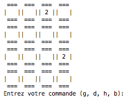

# Fonctionnalité 2 : Afficher la grille de jeu


L'objectif de cette deuxième fonctionnalité est de pouvoir **afficher la grille de jeu proprement**, quelque soit la valeur des tuiles composant le jeu ou quelque soit le thème choisi.

On rappelle que pour ce MVP, il a été choisi un affichage simple du jeu sur la console.




Pour la suite du projet, nous vous laissons libre d'appliquer ou non la méthode TDD. Les différentes étapes ci-dessous et les tests associés vous sont donnés à titre indicatif et comme aide dans la conception de votre programme


## Etape 1 : Afficher une grille initiale de jeu.


Le test pourrait être le suivant :

```PYTHON
def test_grid_to_string():
    grid = [[' ', ' ', ' ', ' '], [' ', ' ', ' ', ' '], [' ', ' ', ' ', ' '], [2, ' ', ' ', 2]]
    a ="""
 === === === ===
|   |   |   |   |
 === === === ===
|   |   |   |   |
 === === === ===
|   |   |   |   |
 === === === ===
| 2 |   |   | 2 |
 === === === ===
    """
    assert grid_to_string(grid, 4) == a[1:-1] # on enleve le premier et le dernier retour chariot
```

## Etape 2 : Prendre en compte la largeur des tuiles

En s'inspirant de l'étape précedente, écrire le test et le code permettant de passer le test pour l'affichage de la grille de jeu prenant en compte la largeur des tuiles et donc la longueur maximale des nombres ou des symboles à afficher dans chaque case.
Pour être uniforme dans vos solutions, il vous est suggéré d' écrire :

+ une fonction `grid_to_string_with_size(grid,n)` qui transforme la grille de jeu en une chaîne de caractères bien formatée et prenant en compte la longueur des symboles à afficher.
+ une fonction `long_value(grid)`qui renvoie la longueur de la plus grande chaîne de caractères dans la grille de jeu.


## Etape 3 : Prendre en compte le thème

La dernière étape est de prendre en compte le thème dans l'affichage de la grille. On rappelle que le thème est fourni sous la forme de la variable `THEMES` donnée ci-dessous.

```PYTHON
THEMES = {"0": {"name": "Default", 0: "", 2: "2", 4: "4", 8: "8", 16: "16", 32: "32", 64: "64", 128: "128", 256: "256", 512: "512", 1024: "1024", 2048: "2048", 4096: "4096", 8192: "8192"}, "1": {"name": "Chemistry", 0: "", 2: "H", 4: "He", 8: "Li", 16: "Be", 32: "B", 64: "C", 128: "N", 256: "O", 512: "F", 1024: "Ne", 2048: "Na", 4096: "Mg", 8192: "Al"}, "2": {"name": "Alphabet", 0: "", 2: "A", 4: "B", 8: "C", 16: "D", 32: "E", 64: "F", 128: "G", 256: "H", 512: "I", 1024: "J", 2048: "K", 4096: "L", 8192: "M"}}
```

Ici, votre code devrait pouvoir passer les tests ci-dessous que vous pouvez bien sûr compléter pour être plus exhaustif :


```PYTHON
def test_long_value_with_theme():
    grid =[[2048, 16, 32, 0], [0, 4, 0, 2], [0, 0, 0, 32], [512, 1024, 0, 2]]
    assert long_value_with_theme(grid,THEMES["0"]) == 4
    assert long_value_with_theme(grid,THEMES["1"]) == 2
    assert long_value_with_theme(grid,THEMES["2"]) == 1
    grid = [[16, 4, 8, 2], [2, 4, 2, 128], [4, 512, 32, 4096], [1024, 2048, 512, 2]]
    assert long_value_with_theme(grid,THEMES["0"]) == 4
    assert long_value_with_theme(grid,THEMES["1"]) == 2
    assert long_value_with_theme(grid,THEMES["2"]) == 1
    
```
et


```PYTHON
def test_grid_to_string_with_size_and_theme():
    grid=[[16, 4, 8, 2], [2, 4, 2, 128], [4, 512, 32, 64], [1024, 2048, 512, 2]]
    a="""
=============
|Be|He|Li|H |
=============
|H |He|H |N |
=============
|He|F |B |C |
=============
|Ne|Na|F |H |
=============
"""
    assert grid_to_string_with_size_and_theme(grid,THEMES["1"],4)== a[1:-1]
    
```

Vous venez de terminer une fonctionnalité donc n'oubliez pas de :

+ <span style='color:blue'>Faire un commit.</span> 
+ <span style='color:blue'>Faire l'étape de revue et de synchro de votre code.</span> 

Maintenant que nous avons notre grille de jeu, nous pouvons maintenant rajouter un peu d'interactivité en permettant à un joueur de jouer au 2048. Il s'agit de la [**Fonctionnalité 3** : Faire jouer le joueur](./2048_S2_joueur.md).
   
    
    
    
    
    
    


