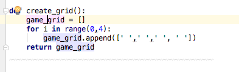
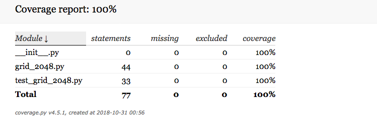
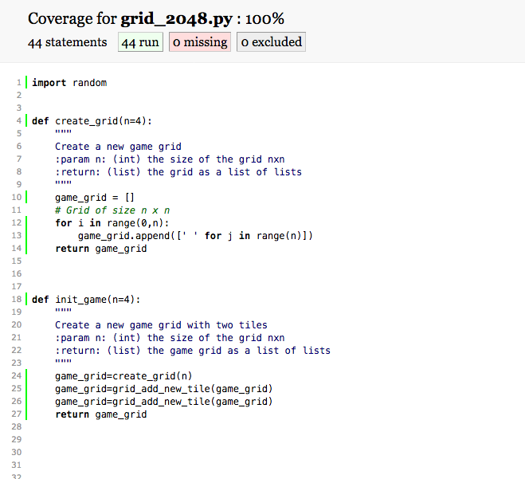

# Fonctionnalité 1 : Représenter la grille de jeu


L'objectif de cette première fonctionnalité est de pouvoir **représenter la grille de jeu**. Il s'agira donc de :

+ Créer un espace de jeu.
+ Créer et ajouter 2 tuiles  (`2` ou `4`) dans l'espace de jeu.


Nous allons ici nous familiariser avec l'approche de développement [**TDD (Test Driven Development)**](https://fr.wikipedia.org/wiki/Test_driven_development) qui consiste à spécifier le comportement attendu via un test avant de l’implémenter effectivement. Le principe est donc d'écrire en premier lieu le test et ensuite le code le plus simple possible qui permette au test de passer et donc de satisfaire le comportement spécifié. Le code peut ensuite être amélioré. L'idée est donc de se focaliser sur les fonctionnalités plutôt que sur le code.

Nous allons d'abord travailler pas à pas puis vous prendrez au fur et à mesure de l'autonomie sur cette approche. 

## Créer un espace de jeu

Pour créér l'espace de jeu, il faut identifier les données qu'il faudra manipuler, c'est-à-dire les données nécéssaires pour représenter la grille du jeu, qui est un conteneur de tuiles ainsi que le contenu des tuiles. Puis, il s'agira ensuite de choisir les structures de données à utiliser.

 1. **Critères d'acceptance.**

 Un des premières tâches à faire ici est de rechercher et de lister l'ensemble des critères qui permettront de répondre correctement aux besoins que la fonctionnalité *Créer un espace de jeu* est sensée couvrir. Ces critères sont des **critères d'acceptance**. Ici, c'est très simple, le critère d'acceptance de *Créer un espace de jeu* est d'**avoir un espace de jeu avec deux tuiles (`2` ou `4`) aléatoirement placées dans l'espace de jeu**.
 
 


 2. **Developpement en mode TDD**

 Le **TDD (Test Driven Development)** est un développement dirigé par les tests et donc la première ligne de votre programme doit être dans un fichier de tests. Dans notre cas, nous utiliserons le module [`pytest`](https://docs.pytest.org/en/latest/) qu'il faut donc ajouter à votre projet. Le principe du TDD repose sur 3 étapes complémentaires.
 
   + Première étape (**<span style='color:red'>RED</span>**) : Ecrire un premier test qui échoue.
   + Deuxième étape (**<span style='color:green'>GREEN</span>**) : Ecrire le code le plus simple qui permet de passer le code.
   + Troisième étape (**REFACTOR**) : Améliorer le code source.


Nous allons donc appliquer cette méthode à la fonctionnalité de la création de la grille du jeu 2048.

#### **<span style='color:red'> ETAPE RED</span>**

Notre premier test va consister à tester que lors de sa création, notre jeu de 2048 dispose bien d'une grille de jeu vide de dimension *4 x 4*.

```PYTHON
from game2048.grid_2048 import create_grid
from pytest import *


def test_create_grid():
    assert create_grid() == [[' ',' ',' ', ' '],[' ',' ',' ', ' '],[' ',' ',' ', ' '],[' ',' ',' ', ' ']]

```

Recopier ce code dans un fichier `test_grid_2048.py` qui vous ajouter à votre projet.
Ce test doit échouer, puisqu'en l'état actuel du projet, le code pour `create_grid` n'existe pas et on a donc l'erreur suivante lors de l'exécution du code <span style='color:red'>`ImportError: cannot import name 'create_grid'`<span>

#### **<span style='color:green'> ETAPE GREEN</span>**

On va maintenant écrire le code qui permet de faire passer ce test le plus rapidement possible.

Il suffit pour cela de :

 + Créer le fichier `grid_2048.py` dans le package `game2048`.
 + Créer et compléter une fonction `create_grid` dans le fichier `grid_2048.py` de telle manière que le test précédent passe.

 On pourra par exemple, définir la fonction ci-dessous dans le fichier `grid_2048.py`

```PYTHON
 def create_grid():
    s = []
    for i in range(0,4):
        s.append([' ',' ',' ', ' '])
    return s
```

 Votre test devrait passer au vert avec cette étape **<span style='color:green'> ETAPE GREEN</span>**


#### **<span style='color:black'> ETAPE REFACTOR</span>**
   
La dernière étape consiste en une étape de [refactoring](https://refactoring.com/), à mettre en place si nécessaire.   

Le [refactoring](https://en.wikipedia.org/wiki/Code_refactoring) (ou réusinage de code) est un principe de programmation qui consiste à changer la structure interne d’un logiciel sans en changer son comportement observable. C'est une étape qui doit toujours être exécutée quand les différents tests sont au vert et qui n'est pas obligatoire. Elle doit surtout permettre d'améliorer la **qualité du code** par exemple en améliorant :
 
 + **la conception** : decoupage en fonctions, modules ou classes afin de rendre votre code le plus simple possible.
 + **la lisibilité du code** : il faut ici prendre le temps d'appliquer les principes du [clean code](https://cleancoders.com/cart) introduit par Robert C. Martin dans l'ouvrage du même nom et dont un des principe est celui des boy-scouts (*« The Boy Scout Rule »*): *« Toujours laisser un endroit dans un état meilleur que celui où vous l’avez trouvé »*.
 
Dans notre cas, un des premiers principes est de vérifier le bon nommage (variables, fonctions, packages, classes et cie) et la présence de commentaires dans notre code. 
 
 Vous trouverez [ici](https://github.com/zedr/clean-code-python#objects-and-data-structures) quelques principes du clean code transposé au langage python. Prenez le temps de lire rapidement ce site et appliquer ces différents principes au code que vous allez écrire.
 
Dans cette étape **<span style='color:black'> ETAPE REFACTOR</span>**, on peut aussi travailler à l'optimisation des performances du programme si cela s'avère vraiment nécessaire.
Dans notre cas, on peut par exemple procéder à une étape de renommage sur la variable `s`. En effet, il peut par exemple être plus explicite de nommer cette variable `game_grid`. Pour réaliser cette étape de renommage, il est fortement conseillé d'utiliser les fonctionnalités de Refactoring de votre IDE. En effet, ici cela ne vous semble peut être pas très utile mais avec un code plus complexe, ce sera très utile.



Dans un souci de généricité, on peut aussi choisir de definir la taille de la grille comme un paramétre de notre fonction `create_grid`. Il faudra bien modifier le code et le code de test en conséquence.

#### **ATTENTION**

1. **Après cette étape, n'oubliez pas de relancer les tests pour vérifier que le comportement de votre code n'a pas changé et que tout est encore bien AU VERT !**

2. On vient ici de terminer la réalisation de l'étape *Créer un espace de jeu* et il convient donc de **committer ce changement dans votre gestionnaire de version avec un message de commit explicite reprenant l'objectif de l'étape**. 


#### **A VOUS de JOUER!**

Vous allez maintenant procéder par itérations pour terminer l'écriture de la  fonctionnalité *Représenter la grille de jeu*  dont on rappelle le critère d'acceptance : **avoir un espace de jeu avec deux tuiles (`2` ou `4`) aléatoirement placées dans l'espace de jeu**.

Chaque itération commence par un test qui échoue mais qui est écrit uniquement s'il apporte un nouveau comportement au système. A la fin de chaque itération, il faut donc se poser la question du prochain test à écrire. Dans notre cas, nous n'avons pas encore traité l'ajout des deux tuiles initiales à notre grille de jeu et le prochain test à écrire peut donc concerner l'ajout de ces deux tuiles dans la grille de jeu.

##### Positionner deux tuiles de valeur 2 ou 4 dans la grille de jeu.


 1. **Critères d'acceptance.**

 + Deux nouvelles tuiles sont créés.
 + Ces nouvelles tuiles sont positionnées dans la grille de jeu aux coordonnées choisies aléatoirement parmi les positions possibles.


 2. **Developpement en mode TDD**

En appliquant le principe du TDD décrit précédemment, vous allez donc écrire le code pour terminer l'écriture de cette fonctionnalité.
En particulier, il est conseillé d'itérer sur les tests décrits ci-dessous. Ces différents tests correspondant à chaque itération à l'étape **<span style='color:red'> ETAPE RED</span>**. Il vous est demandé de faire les deux autres étapes du cycle TDD pour passer ces tests en vert et améliorer la qualité de votre code.

+ **Itération 1 - Test : Une tuile de valeur`2`est placée à une position donnée** 

```PYTHON
def test_grid_add_new_tile_at_position():
    game_grid=create_grid(4)
    game_grid=grid_add_new_tile_at_position(game_grid,1,1)
    assert game_grid==[[' ',' ',' ', ' '],[' ', 2 ,' ', ' '],[' ',' ',' ', ' '],[' ',' ',' ', ' ']]
```


+ **Itération 2 - Test : la valeur d'une nouvelle tuile est `2` ou `4`**. 


```PYTHON
def test_grid_add_new_tile_at_position():
    game_grid=create_grid(4)
    game_grid=grid_add_new_tile_at_position(game_grid,1,1)
    tiles = get_all_tiles(game_grid)
    assert 2 in tiles or 4 in tiles

def test_get_value_new_tile():
    assert get_value_new_tile() in {2, 4}


def test_get_all_tiles():
    assert get_all_tiles( [[' ',4,8,2], [' ',' ',' ',' '], [' ',512,32,64], [1024,2048,512, ' ']]) == [0,4,8,2,0,0,0,0,0,512,32,64, 1024,2048,512,0]
    assert get_all_tiles([[16,4,8,2], [2,4,2,128], [4,512,32,64], [1024,2048,512,2]]) == [16, 4, 8, 2, 2, 4, 2, 128, 4, 512, 32, 64, 1024, 2048, 512, 2]
    assert get_all_tiles(create_grid(3))== [0 for i in range(9)]
```


Plus précisement, une nouvelle tuile ajoutée au jeu a 90 % de chance d'avoir la valeur 2 et 10% la valeur 4. On ne testera pas cet aspect mais votre code devra pouvoir ajouter des tuiles au jeu respectant cette propriété.

 + **Itération 3 - Test : une nouvelle tuile est placée aléatoirement dans une case disponible de la grille de jeu.**


```PYTHON
def test_get_empty_tiles_positions():
    assert get_empty_tiles_positions([[0, 16, 32, 0], [64, 0, 32, 2], [2, 2, 8, 4], [512, 8, 16, 0]])==[(0,0),(0,3),(1,1),(3,3)]
    assert get_empty_tiles_positions([[' ', 16, 32, 0], [64, 0, 32, 2], [2, 2, 8, 4], [512, 8, 16, 0]])==[(0,0),(0,3),(1,1),(3,3)]
    assert get_empty_tiles_positions(create_grid(2))==[(0,0),(0,1),(1,0),(1,1)]
    assert get_empty_tiles_positions([[16,4,8,2], [2,4,2,128], [4,512,32,64], [1024,2048,512,2]])==[]


```

```PYTHON

def test_get_new_position():
    grid = [[0, 16, 32, 0], [64, 0, 32, 2], [2, 2, 8, 4], [512, 8, 16, 0]]
    x,y=get_new_position(grid)
    assert(grid_get_value(grid,x,y)) == 0
    grid = [[' ',4,8,2], [' ',' ',' ',' '], [' ',512,32,64], [1024,2048,512, ' ']]
    x,y=get_new_position(grid)
    assert(grid_get_value(grid,x,y)) == 0
```

```PYTHON

def test_grid_add_new_tile():
    game_grid=create_grid(4)
    game_grid=grid_add_new_tile(game_grid)
    tiles = get_all_tiles(game_grid)
    assert 2 in tiles or 4 in tiles
    
```

Ici, il est demandé dans l'étape **<span style='color:black'> REFACTOR </span>** de modifier la signature de la fonction `grid_add_new_tile_at_position` pour `grid_add_new_tile`. Vous pouvez une nouvelle fois utiliser les fonctionnalités de Refactoring de votre IDE pour le faire facilement.


 + **Itération 4 - Test : ajouter 2 tuiles dans l'espace de jeu.** 

```PYTHON

def test_init_game():
    grid = init_game(4)
    tiles = get_all_tiles(grid)
    assert 2 in tiles or 4 in tiles
    assert len(get_empty_tiles_positions(grid)) == 14
```

A la fin de ces 4 itérations, vous avez normalement écrit l'ensemble du code nécéssaire à la réalisation de la fonctionnalité 1 : **Représenter la grille de jeu**.

#### <span style="color: #26B260"> :clap: A ce stade du projet, vous avez atteint le JALON 3 : Ecrire du code dans une démarche TDD </span> 


**<span style='color:blue'>Commiter maintenant vos changements dans votre gestionnaire de version. C'est aussi le moment de faire la mise en commun et la revue de code avec les autres membres de votre équipe.</span>**


#### <span style="color: #26B260"> :clap: A ce stade du projet, vous avez atteint le JALON 4 : une première vraie utilisation de git et gitlab avec mon groupe projet </span> 


## A propos de la couverture de code par vos tests

Une couverture de code par les tests (code coverage) nous permet de connaître le pourcentage de notre code qui est testé et donc cela permet d'avoir une idée de ce qui reste d'ombre dans notre projet.

En règle générale, on considère qu'une couverture de code supérieure à 80% est signe d'un projet bien testé et auquel il sera alors plus facile de rajouter de nouvelles fonctionnalités.

Pour connaitre le taux de couverture de votre projet, vous pouvez utiliser des bibliothèques python [`coverage`] et [`pytest_cov`] qu'il faut donc installer soit en ligne de commande soit depuis votre IDE.

`pip3 install coverage` ou `pip install coverage`

`pip3 install pytest-cov` ou `pip install pytest-cov`


Il faut ensuite vous placer dans le répertoire de votre projet et lancer la commande suivante :

`pytest --cov=game2048 --cov-report html test_*.py`

Cette commande permet de tester les fichiers contenus dans le dossier `game2048`. Elle crée un rapport en html et le place dans le répertoire `htmlcov` et utilise les tests qui sont dans ce répertoire et qui sont de la forme `test_[caracteres].py`.

L'ouverture du fichier `index.html`dans le répertoire `htmlcov`vous permet de visualiser un bilan du test de couverture qui devrait être bon dans la mesure où nous avons utilisé l'approche TDD. Un clic sur chacun des fichiers permet aussi d'avoir un bilan propre à chaque fichier.







#### <span style="color: #26B260"> :clap: A ce stade du projet, vous avez atteint le JALON 5 : une première couverture de mon projet par des tests </span> 


## A propos de la gestion des versions

<span style='color:blue'> Pour toute la suite du projet, il vous est demandé de :</span> 

+ <span style='color:blue'>Faire un commit dès que la réalisation d'une fonctionnalité ou d'une sous-fonctionnalité est finie.</span> 
+ <span style='color:blue'>Tagger à la fin de chaque journée votre dernier commit </span> 
+ <span style='color:blue'>De faire une revue de code au sein de l'équipe pour chaque fonctionnalité.</span>
+ <span style='color:blue'>De mettre le code stable sur la branche `master`.</span>
+ <span style='color:blue'>Pousser (Push) le code vers votre dépôt distant sur GitLab.</span> 
+ <span style='color:blue'>Faire un test de couverture de code à la fin de chaque journée et de pousser le bilan obtenu vers votre dépôt distant sur GitLab.</span>


vous pouvez maintenant passer à la [**Fonctionnalité 2** : Afficher une grille de jeu.](./2048_S1_Display_Grille.md).
 
 
 
    
 


 
 
 
    

