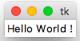

# Montée en compétences : les interfaces graphiques en python


Il existe un certain nombre de frameworks pour le developpement d'interfaces graphiques en python. Une liste de ces différents outils est disponible [ici](https://wiki.python.org/moin/GuiProgramming).

En particulier, la bibliothèque standard de python possède un module appelé **Tkinter (Tk interface)** et qui permet de developper des interfaces graphiques. Nous nous contenterons d'utiliser ce module dans cette partie du projet qui ne nécessite pas d'installation.

Une documentation de ce module est disponible [ici](https://wiki.python.org/moin/TkInter).

Vous allez maintenant faire un rapide tutorial (inspiré du cours d'OpenClassRooms [Apprenez à programmer en python ](https://openclassrooms.com/fr/courses/235344-apprenez-a-programmer-en-python/234859-des-interfaces-graphiques-avec-tkinter) ainsi que de ce [tutorial](https://www.python-course.eu/python_tkinter.php)) pour nous familiariser avec ce module et cet outil.

Le [tutorial de Vincent Maillol](https://vincent.developpez.com/cours-tutoriels/python/tkinter/apprendre-creer-interface-graphique-tkinter-python-3/) est aussi fortement conseillé.

Une autre documentation bien faite de Tkinter en français est disponible [ici](http://tkinter.fdex.eu/index.html)


## Une première interface graphique en Tkinter

Ajouter un fichier `tuto_GUI.py` à votre projet et copier le code ci-dessous qui correspond à la création d'une fenêtre qui affiche le message *Hello World!*.

```PYTHON
from tkinter import *

# Window creation, root of the interface
window = Tk()

# Creation of a label (text line) that says Hello World ! and with as first parameter the previous window
label_field = Label(window,text="Hello World !")

# Display of the label
label_field.pack()

# Running of the Tkinter loop that ends when we close the windw
window.mainloop()
```

L'exécution de ce code devrait vous afficher la fenêtre suivante.




La méthode `config()` permet de configurer des widgets. Par exemple, dans l'exemple précédent, les deux lignes suivantes 
``` PYTHON
label_field = Label(window,text="Hello World !")
label_field.config(text="Hello World !")
```
sont équivalentes  à
```
label_field = Label(window,text="Hello World !")
```


`pack` est un gestionnaire de géométrie qui gère la composition des widgets.

Le placement du widget se fait par rapport à son contenant (avec l’option de configuration `side`) en utilisant un placement cardinal (`Tkinter.TOP`, `Tkinter.LEFT`, `Tkinter.RIGHT`, `Tkinter.BOTTOM`). Par défaut, un widget est attaché en haut, ou au-dessous des widgets existants


Si l’on souhaite une occupation maximale de l’espace, utiliser l’option de configuration `expand=YES`. La direction de l’occupation maximale est précisée par `fill`. Elle peut être en largeur (`Tkinter.X`), en hauteur (`Tkinter.Y`) ou les deux (`Tkinter.BOTH`).


D'autres gestionnaires de position sont disponibles en Tkinter, le gestionnaire `grid` qui découpe le conteneur en grille et place le widget dans une cellule de cette grille et le gestionnaire `place` qui positionne le widget au pixel près mais qui est difficile à utiliser dans la pratique.


## Découverte des principaux widgets de Tkinter


Tkinter possède un certain nombre de widgets, des objets graphiques, comme des boutons, des champs de texte, des cases à cocher, des barres de progression…). Nous allons ici présenter les principaux.

### Label

Dans l'exemple précédent, nous avons vu le widget `Label` qui permet d'afficher du texte dans la fenêtre principale. Ce texte ne peut pas être modifié par l'utilisateur.

### Button

Les boutons (`Button`) sont des widgets sur lesquels on peut cliquer et qui peuvent déclencher des actions ou **commandes**.

Copier le code précédent dans votre fichier test et executer le. Que fait-il?


``` PYTHON
import tkinter as tk


def write_text():
    print("Hello CentraleSupelec")

root = tk.Tk()
frame = tk.Frame(root)
frame.pack()

button = tk.Button(frame,
                   text="QUIT",
                   activebackground = "blue",
                   fg="red",
                   command=quit)
button.pack(side=tk.LEFT)
slogan = tk.Button(frame,
                   fg="blue",
                   text="Hello",
                   command=write_text)
slogan.pack(side=tk.LEFT)

root.mainloop()

```

Attention, pour les utilisateurs de MAC OSX, les couleurs peuvent ne pas être prises en compte. Des indications sont disponibles [ici](https://stackoverflow.com/questions/1529847/how-to-change-the-foreground-or-background-colour-of-a-tkinter-button-on-mac-os).

Cet exemple illustre comment initier un traitement depuis une interface graphique. Ici, la commande `quit` est associée au premier bouton pour quitter la fenêtre et la commande définie par la fonction `write_text()` est associée au deuxième bouton.


### Entry
Le widget `Entry` est un widget de saisie de données. Il sert à recueillir la saisie d'un utilisateur. Il prend en paramètre un objet de type `StringVar` qui va servir à récupérer le texte de la saisie. Si la `StringVar` est mise à jour, le champ de saisie est également modifié.


Tester le code ci-dessous


``` PYTHON
from tkinter import Tk, StringVar, Label, Entry, Button
from functools import partial

def update_label(label, stringvar):
    """
    Met à jour le texte d'un label en utilisant une StringVar.
    """
    text = stringvar.get()
    label.config(text=text)
    stringvar.set('merci')

root = Tk()
text = StringVar(root)
label = Label(root, text='Your name')
entry_name = Entry(root, textvariable=text)
button = Button(root, text='clic',
                command=partial(update_label, label, text))

label.grid(column=0, row=0)
entry_name.grid(column=0, row=1)
button.grid(column=0, row=2)

root.mainloop()

```

Le widget `Button` prend en paramètre un texte à afficher et une fonction à exécuter.

La fonction à exécuter ne prend pas de paramètre et pour utiliser une foncion déjà ecrite il faut l'encapsuler avec le module [`partial`](https://docs.python.org/2/library/functools.html). 

A l'aide du tutorial disponible [ici](https://www.python-course.eu/tkinter_radiobuttons.php), explorez les autres widgets de Tkinter comme par exemples les [`Radiobutton`](https://www.python-course.eu/tkinter_radiobuttons.php) ou les [`Checkbutton`](https://www.python-course.eu/tkinter_checkboxes.php).


## Les Conteneurs

Les conteneurs sont des widgets destinés à contenir d'autres widgets.

Dans nos exemples, nous avons déjà utilisé les fenêtres (Toplevel) via l'instruction `root = Tk()`. 

Parmi les conteneurs, il y a aussi le widget `Frame`qui permet de regrouper plusieurs widgets entre eux. Cela peut simplifier leur placement par la suite comme dans l'exemple ci-dessous que vous devez executer.


```
from tkinter import Tk, Label, Frame

root = Tk()
f1 = Frame(root, bd=1, relief='solid')
Label(f1, text='je suis dans F1').grid(row=0, column=0)
Label(f1, text='moi aussi dans F1').grid(row=0, column=1)

f1.grid(row=0, column=0)
Label(root, text='je suis dans root').grid(row=1, column=0)
Label(root, text='moi aussi dans root').grid(row=2, column=0)

root.mainloop()
```

## Les évènements

Il est possible de récupérer des événements, comme la frappe d'une touche ou un clic de souris pour effectuer un traitement spécial. Pour qu'un widget puisse traiter les événements, il faut que celui-ci ait le focus. Généralement, un widget prend le focus lorsque l'on clique dessus. Les événements peuvent ensuite être traités par une fonction.


Le code ci-dessous que vous devez tester affiche *Hello* en fonction des clics ou de l'appui d'une des touches du clavier.

```PYTHON
from tkinter import *
from pprint import pformat

def print_bonjour(i):
    label.config(text="Hello")

root = Tk()
frame = Frame(root, bg='white', height=100, width=400)
entry = Entry(root)
label = Label(root)

frame.grid(row=0, column=0)
entry.grid(row=1, column=0, sticky='ew')
label.grid(row=2, column=0)

frame.bind('<ButtonPress>', print_bonjour)
entry.bind('<KeyPress>', print_bonjour)
root.mainloop()
```

Prenez le temps de lire rapidement ce [très bon tutoriel](http://tkinter.fdex.eu/doc/event.html) concernant les évènements en Tkinter.

Vous pouvez maintenant vous atteler à votre 2048 avec interface graphique. N'hésitez pas à revenir vers les différents tutoriaux mentionnés pour approfondir votre connaissance de Tkinter.

Nous pouvons maintenant passer à notre [Fonctionnalité 8 : Affichage de la grille de jeu dans une fenêtre Tkinter](./2048_S6_affichagegrille.md).


