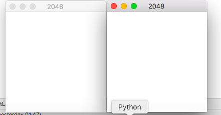
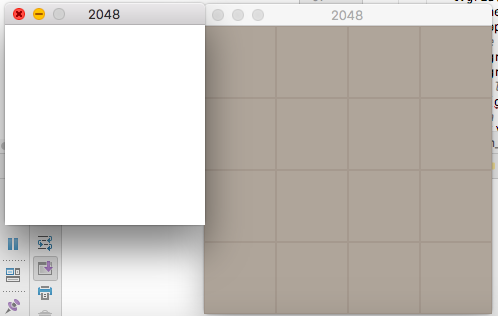
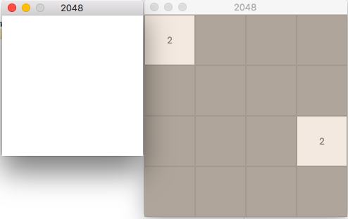

# Fonctionnalité 8 : Affichage de la grille de jeu dans une fenêtre Tkinter

Il s'agit ici de mettre en place votre interface Tkinter pour l'affichage du jeu. On travaillera dans un premier temps sur le module `display_grid`

## Etape 1 : Création de la structure Tkinter pour afficher la grille de jeu.

L'étape 1 consiste en l'affichage de la grille de jeu initiale en Tkinter. Dans cette étape, on s'intéressera uniquement à l'affichage de la grille. Il n'y aura pas d'actions associées aux différents objets de la grille.

Pour cette étape, il est nécessaire de :

 + Definir avec quel type d'objets widgets notre grille sera représentée.
 + Definir un certain nombre de constantes qui serviront à l'affichage de la grille comme par exemple les couleurs des différentes tuiles en fonction de leur valeur, les couleurs des valeurs elle-mêmes, la taille de la fenêtre principale.

### Choix de représentation de la grille de jeu en Tkinter

Pour l'affichage de notre grille de jeu avec Tkinter, nous allons utiliser le widget `Toplevel` qui permet de créer des fenêtres primaires, c'est-à-dire des fenêtres qui possèdent une existence indépendante pour le gestionnaire de fenêtre du système d’exploitation.

Une bonne explication de ce type de widget est disponible [ici](http://tkinter.fdex.eu/doc/toplww.html).

Dans une fonction que vous nommerez `2048_graphical_grid_init()`, vous commencerez donc par :

+ Créer une fenêtre principale avec Tkinter, intitulée 2048 et créer un widget `Toplevel`, intitulé 2048 que vous associerez à votre fenêtre principale.
+ Placer ce widget à l'aide de la fonction de placement `grid()` de Tkinter.

A ce stade, vous devriez avoir ceci à l'exécution de votre programme.

Nous avons donc deux fenêtres. A ce stade, vous pouvez-vous demander pourquoi ! Vous comprendrez l'utilité de ces deux fenêtres par la suite.

###  Representation de la grille de tuiles

Nous allons maintenant créer et afficher l'univers lui-même.

+ Initialiser un univers de jeu.
+ Pour représenter notre univers de jeu qui est donc une grille de cellules, chaque cellule permettant de représenter une tuile, nous allons d'abord définir une `Frame` qui représentera le backgroud de notre jeu et qui *contiendra* les différenres cellules. Créer donc la variable `background` qui fera référence à un widget `Frame` représentant le fond de notre jeu.
+ Regarder le widget [`Canvas`](http://tkinter.fdex.eu/doc/caw.html) pour l'affichage de la grille de jeu.

Nous avons donc à ce stade deux objets grille :
+ `grid_game` qui contient les données du jeu, donc les données à afficher (le **MODELE**).
+ `graphical_grid`, notre structure de données Tkinter qui contient la présentation de l'interface graphique (la **VUE**).

Cette manière de procéder est très classique en développement d'interfaces graphiques. Elle correspond à un motif d'architecture logicielle appelé [**Modèle-vue-contrôleur ou MVC**](https://fr.wikipedia.org/wiki/Mod%C3%A8le-vue-contr%C3%B4leur) dédié aux interfaces graphiques, datant de 1978 et devenu très populaire. Ce motif est composé de trois types de modules ayant trois responsabilités différentes : les modèles, les vues et les contrôleurs :

 + Un **modèle (Model)** qui  contient les données à afficher.
+ Une **vue (View)** qui contient la présentation de l'interface graphique.
+ Un **contrôleur (Controller)** qui contient la logique concernant les actions effectuées par l'utilisateur.

Nous avons donc pour l'instant respecté ce principe avec au moins les deux premiers modules. Il nous faut cependant encore connecter la vue au modèle et c'est ce que nous allons faire tout de suite.

###  Affichage des valeurs de la grille réelle de jeu.

Il s'agit maintenant d'afficher sur votre interface les valeurs des tuiles correspondant à la *vraie* grille de jeu, c'est-à-dire la grille `grid_game`, votre modèle.

Pour cela, il faut configurer vos cellules en mettant à jour les paramètres `text`, `bg` et `fg` de vos différents objets `Frame` avec les valeurs correspondantes dans `grid_game`.

Avant d'écrire votre code, il est nécéssaire de prendre un peu de temps pour réflechir à la conception. Le type de question qu'il faut vous poser est le nombre de fois que cette opération de mise à jour de la vue peut se produire dans le déroulé du jeu. Une fois ? Plusieurs fois ? A chaque tour de jeu ?

En fonction de votre réponse, il peut donc être utile de mettre le code correspondant à cette tâche dans une fonction, par exemple appelée `display_and_update_graphical_grid()` que vous pourrez appeler dès que nécessaire.

Pour une grille initiale correspondant à `[[2, 0, 0, 0], [0, 0, 0, 0], [0, 0, 0, 2], [0, 0, 0, 0]]`, vous devriez avoir ce type de vue.

#### A ce stade du projet, vous avez atteint le JALON 12 : Se familiariser avec le design pattern MVC  

## Etape 2 : Mise en place des actions du joueur via l'interface graphique

Nous devons maintenant travailler sur le traitement des évènements de notre interface pour répondre aux actions de l’utilisateur. Pour jouer, l'utilisateur a juste besoin d'indiquer une direction et il semble donc naturel de le faire via les 4 flèches de son clavier. Nous sommes donc en présence d'un évènement de type `KeyPress` et vous pourrez retrouver les différentes manières de nommer les touches [ici](http://infohost.nmt.edu/tcc/help/pubs/tkinter/web/key-names.html) ou dans ce [tutorial](http://tkinter.fdex.eu/doc/event.html).

Ecrire une fonction `key_pressed(event)` qui exécute les actions de jeu, i.e. les directions données par l'utilisateur via son clavier, sur la grille de jeu et met à jour l'interface graphique. 

Cette fonction est un gestionnaire d'évènements et il ne faudra pas oublier de l'attacher au widget de votre jeu, la fenêtre `graphical_grid` à l'aide de la fonction `bind` pour rendre notre interface graphique réacive aux actions de l'utilisateur. 

### Etape 3 : Jouez !
A ce stade du projet, vous devriez déjà pouvoir jouer au 2048 via votre interface graphique. Prenez le temps de le faire et n'oubliez pas de lister les fonctionnalités qui vous semblent manquantes.

Nous avons maintenant terminé cette fonctionnalité, il vous faut :

+ Faire un commit 
+ Faire l'étape de revue et de synchronisation 

Nous pouvons maintenant ajouter des moyens graphiques de configurer le jeu. Il s'agit de la [Fonctionnalité 9 : Permettre la configuration du jeu via l'interface graphique](./2048_S6_configgrille.md)

		 

 