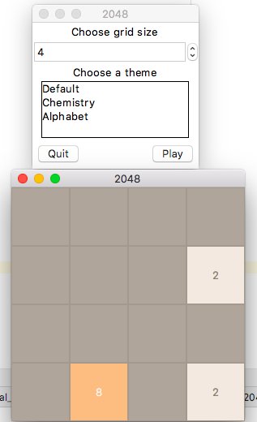

# Fonctionnalité 9 : Permettre la configuration du jeu via l'interface graphique

Dans cette fonctionnalité, nous allons ajouter un certain nombre de widgets à notre fenêtre principale (la fenêtre blanche laissée vide) pour permettre :

+ De choisir la taille de la grille.
+ De choisir le thème.
+ De pouvoir quitter le jeu.
+ De pouvoir initialiser un jeu et jouer.
+ De pouvoir afficher un message de victoire quand une partie est gagnée.

A minima, votre jeu pourrait ressembler à celui-ci-dessous.

Vous pouvez maintenant ajouter d'autres fonctionnalités à votre jeu. Quelques idées :

 + Pouvoir sauvegarder et charger une grille existante.
 + Permettre de revenir en arrière après un coup décevant.
 + Ajouter des sons à votre programme en utilisant [`pygame`](https://www.pygame.org/news). Voir [cette documentation](http://bacisn.ghmesnil.com/2016/03/21/mettre-des-effets-sonores-avec-pygame/)
 + ...

 
## Pour finir 

+ Faire un commit de vos derniers changements. 
+ Tagger ce dernier commit  
+ Faire le travail de revue et de synchronisation. 
+ Faire un test de couverture de code de votre MVP et pousser le bilan obtenu vers votre dépôt distant sur GitLab.

