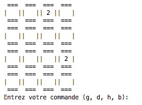

# Programmation d'un 2048

L'**objectif** de ce mini-projet est de développer, de manière très incrémentale, le jeu 2048 afin de vous former aux bonnes pratiques de la programmation et à la culture de la qualité logicielle. En particulier, au travers de ce projet, vous allez découvrir plusieurs principes du mouvement dit du [*Software Craftmanship*](https://www.octo.com/fr/publications/20-culture-code). 


## A propos du jeu 2048

2048 est un jeu vidéo de type puzzle conçu en mars 2014 par le développeur indépendant italien Gabriele Cirulli et publié en ligne sous licence libre via Github [ici](http://gabrielecirulli.github.io/2048/). Si vous ne connaissez pas ce jeu, prenez 5 minutes pour faire quelques parties !


Les règles du jeu sont simples :

 + A chaque tour, un chiffre 2 ou 4 apparaît dans une case vide d’une grille 4x4. 
 + Le joueur peut choisir entre 4 directions (haut, bas, gauche, droite).
 + Les chiffres de la grille sont bougés comme s’ils tombaient dans la direction souhaitée par le joueur.
 + Deux chiffres identiques consécutifs qui rentrent en collision pendant le mouvement sont remplacés par leur somme. 
 	+ Toute case résultant d'une fusion dans ce tour ne peut intervenir dans une nouvelle fusion de ce tour.
 	+ Les fusions sont accomplies en commençant par celle la plus proche du bord (de la direction choisie) puis en remontant dans le sens inverse de la direction. 	

Par exemple, pour un déplacement vers la gauche, la ligne `2 2 4 4`deviendra la ligne `4 8 0 0` et pour ce même déplacement la ligne `4 2 2 0` deviendra `4 4 0 0` car le deuxième `4` venant d'être créé, il ne sera pas fusionné à ce tour. 

Le but du jeu est de faire glisser des tuiles sur la  grille pour créer une tuile portant **au moins** le nombre 2048. Le joueur peut toutefois continuer à jouer après cet objectif atteint pour faire le meilleur score possible. De même, par défaut la grille est de taille 4 x 4 mais nous pourrons aussi en faire un paramètre de notre programme, qui par défaut sera donc de 4 x 4.


## Organisation du mini-projet

Ce mini-projet est découpé en plusieurs objectifs, eux-même découpés en  **sprints** et **fonctionnalités**. La notion de sprint fait référence à la [méthode agile](https://fr.wikipedia.org/wiki/M%C3%A9thode_agile). Un sprint correspond à un intervalle de temps pendant lequel l’équipe projet va compléter un certain nombre de tâches.

# 2048 - Sprint 0 : Analyse du problème

Une des premières étapes de tout travail de programmation et de développement logiciel, quelque soit la méthodologie de développement utilisée, consiste à réaliser une rapide **analyse des besoins**, avant toute phase d'implémentation.

Cette analyse a pour objectif d'identifier les principales fonctionnalités à developper pour avoir le comportement souhaité du système développé. Cette première liste de fonctionnalités n'a pas besoin d'être exhaustive ni figée mais elle vous permettra de construire vos premiers développements.


## Analyse des besoins : les principales fonctionnalités

L'objectif ici est de permettre à un joueur (vous !) de **jouer le plus rapidement possible** au 2048 et il s'agira donc de concevoir un logiciel permettant de jouer au 2048 en mode console, sans interface graphique, sans gestion des joueurs. 

Le **[MVP (Minimum Viable product)](https://medium.com/creative-wallonia-engine/un-mvp-nest-pas-une-version-simplifi%C3%A9e-de-votre-produit-89017ac748b0)** de ce projet consistera à livrer une première version du jeu en mode console. Notre solution

+  **Permettra d'afficher proprement une grille de 4 x 4 dans laquelle seront placées aléatoirement 2 tuiles portant le nombre 2 ou 4 ainsi que les tuiles résultant du jeu**.
+  **Permettra de gérer plusieurs thèmes de jeux.** En particulier, nous considérerons les 3 thèmes ci-dessous et qui seront fournis sous la forme d'un dictionnaire python

```PYTHON
THEMES = {"0": {"name": "Default", 0: "", 2: "2", 4: "4", 8: "8", 16: "16", 32: "32", 64: "64", 128: "128", 256: "256", 512: "512", 1024: "1024", 2048: "2048", 4096: "4096", 8192: "8192"}, "1": {"name": "Chemistry", 0: "", 2: "H", 4: "He", 8: "Li", 16: "Be", 32: "B", 64: "C", 128: "N", 256: "O", 512: "F", 1024: "Ne", 2048: "Na", 4096: "Mg", 8192: "Al"}, "2": {"name": "Alphabet", 0: "", 2: "A", 4: "B", 8: "C", 16: "D", 32: "E", 64: "F", 128: "G", 256: "H", 512: "I", 1024: "J", 2048: "K", 4096: "L", 8192: "M"}}
```


+ **Permettra à l'utilisateur de jouer en lui demandant une direction parmi (bas, haut, droite, gauche)**. 
+ **Modifiera la grille de jeu en prenant en compte l'instruction du joueur et en effectuant les transformations nécessaires**. 
+  **Permettra de passer au coup suivant en faisant apparaitre aléatoirement un 2 ou un 4 dans une case vide**.
+  **Testera la fin du jeu  (gagné ou perdu) et affichera, dans tous les cas, le score obtenu**.

 

# 2048 - Sprint 0 : Réflexion autour de la conception

Après cette phase d'analyse, nous pouvons avoir une première démarche de conception et essayer d'identifier les principaux objets de notre MVP. 

En lisant la [description du jeu sur Wikipedia](https://fr.wikipedia.org/wiki/2048_(jeu_vid%C3%A9o)), on identifie notamment le concept de **grille**, de **tuile** et de **déplacement**. On se contentera de ces trois objets dans cette phase.

## Vers un langage commun

Dans cette phase de réflexion sur la conception, pour favoriser le travail collaboratif et une compréhension commune entre tous les membres du projet, il est important de définir, dès le début du projet, un **vocabulaire commun** autour des termes métier. Dans le jargon du développement de logiciel, on parle de [**ubiquitous language**](http://referentiel.institut-agile.fr/ubiquitous.html) ou **langage omniprésent**. C'est un principe issu de l'approche *Domain Driven Design* décrite dans l'[ouvrage](https://github.com/p0w34007/ebooks/blob/master/Eric%20Evans%202003%20-%20Domain-Driven%20Design%20-%20Tackling%20Complexity%20in%20the%20Heart%20of%20Software.pdf) du même nom et qui consiste à identifier et à définir un langage commun autour des termes métiers.


Concernant le langage partagé, dans le cas du jeu 2048, plusieurs termes sont utilisés pour parler de la grille de jeu : *plateau*, *grille*, *puzzle*... 

Pour la suite du projet, on choisit le nom de **grille** pour désigner le plateau de jeu et que nous définirons comme le conteneur de l'ensemble des tuiles du jeu.

Une **tuile** est un élement de jeu qui peut prendre une valeur comprise entre 2 et 2048 et telle que sa valeur est une puissance de 2 et qui peut être déplacée selon 4 directions dans la grille de jeu.

Un **déplacement** est une indication de la direction donnée par le joueur pour déplacer l'ensemble des tuiles de la grille de jeu.


Nous allons maintenant créer ces trois objets du point de vue informatique.

#### <span style="color: #26B260"> 


### Objectif 1 (MVP): Un 2048 minimum, sans interface graphique, sans gestion des joueurs

Le premier objectif est de constuire et d'implémenter une version simple du jeu 2048 que l'on pourrait qualifier de **[MVP (Minimum Viable product)](https://medium.com/creative-wallonia-engine/un-mvp-nest-pas-une-version-simplifi%C3%A9e-de-votre-produit-89017ac748b0)**. C'est l'objectif minimal à atteindre pour cette première semaine.

Ce concept de MVP a été popularisé par Eric Ries, l'auteur de [The Lean Startup](http://theleanstartup.com/), une approche spécifique du démarrage d'une activité économique et du lancement d'un produit. La figure ci-dessous permet de bien expliquer ce concept.


 + **Sprint 0** :
	 + [Installation du socle technique.](./Sprint0Installbis.md)
	 + [Analyse des besoins.](./Sprint0Analyse.md) 
	 + [Refexion autour de la conception.](./Sprint0Conception.md)

 + **Sprint 1 : Mise en place des données du jeu**
 	+ [**Fonctionnalité 1** : Représenter une grille de jeu.](./2048_S1_Grille.md)
 	+ [**Fonctionnalité 2** : Afficher une grille de jeu.](./2048_S1_Display_Grille.md)
 		
 + **Sprint 2** : **Actions des joueurs**
 	+ [**Fonctionnalité 3** : Faire jouer le joueur -Donner une instruction de jeu.](./2048_S2_joueur.md)


 + **Sprint 3** : **Gestions des déplacements des tuiles**
 	+ [**Fonctionnalité 4** : Gestion des déplacements](./2048_S3_regles.md)
 	+ [**Fonctionnalité 5** : Tester la fin du jeu](./2048_S3_Finjeu.md)

 + **Sprint 4** : **Jouer !**	

 	+ [**Fonctionnalité 6** : Faire jouer un joueur](./2048_S4_Playing.md)


### Objectif 2 : Un 2048 avec une interface graphique (Amélioration du MVP)

Lors du test de votre MVP, vous avez dû trouver le jeu sans interface graphique assez pénible. Ce sont aussi les premiers retours utilisateurs. Votre travail consiste donc ici à faire évoluer votre produit en prenant en compte ces premiers retours, notamment en améliorant l'interface par l'ajout d'une interface graphique. 


+  **Sprint 5 : Montée en compétences sur les interfaces graphiques**
	+ [Montée en compétences : les interfaces graphiques en python](./2048_S5_GUI_Tutorial.md)
+  **Sprint 6 :Creation de l'interface pour la grille de jeu** 
	+ [**Fonctionnalité 8** : Affichage de la grille de jeu dans une fenêtre Tkinter](./2048_S6_affichagegrille.md)
	+ [**Fonctionnalité 9** : Permettre la configuration du jeu via l'interface graphique](./2048_S6_configgrille.md)


### Objectif 3 : Un 2048 avec la gestion des joueurs, de leur score, suggestions de coups et cie.

Vous avez, au travers des deux objectifs précédents, découvert des méthodes de développement et notamment les étapes d'analyse, de conception et de développement. Les étapes d'analyse et de conception doivent vous permettre  de découper un objectif en `Sprints` , eux-mêmes composés de différentes **fonctionnalités**. 

A nouveau, l'achèvement de l'objectif 2 a dû vous permettre de pouvoir avoir des premiers retours utilisateurs. Si vous êtes arrivés à cette étape du projet, vous pouvez appliquer tout cela pour réaliser l'objectif 3. Vous devrez déposer avec le code de votre projet, un fichier décrivant le découpage proposé et réalisé à l'instar de ce qui vous a été proposé pour les deux premiers exercices.

# Fonctionnalité 1 : Représenter la grille de jeu


L'objectif de cette première fonctionnalité est de pouvoir **représenter la grille de jeu**. Il s'agira donc de :

+ Créer un espace de jeu.
+ Créer et ajouter 2 tuiles  (`2` ou `4`) dans l'espace de jeu.


Nous allons ici nous familiariser avec l'approche de développement [**TDD (Test Driven Development)**](https://fr.wikipedia.org/wiki/Test_driven_development) qui consiste à spécifier le comportement attendu via un test avant de l’implémenter effectivement. Le principe est donc d'écrire en premier lieu le test et ensuite le code le plus simple possible qui permette au test de passer et donc de satisfaire le comportement spécifié. Le code peut ensuite être amélioré. L'idée est donc de se focaliser sur les fonctionnalités plutôt que sur le code.


# Fonctionnalité 2 : Afficher la grille de jeu


L'objectif de cette deuxième fonctionnalité est de pouvoir **afficher la grille de jeu proprement**, quelque soit la valeur des tuiles composant le jeu ou quelque soit le thème choisi.

On rappelle que pour ce MVP, il a été choisi un affichage simple du jeu sur la console.





# Fonctionnalité 3 : Faire jouer le joueur.


L'objectif de cette fonctionnalité est de rendre le jeu interactif en permettant à un joueur de donner ses instructions de jeu. Pour ce MVP, nous nous contenterons d'instructions textuelles que l'utilisateur donnera via l'entrée standard.

On peut prendre, ici, un peu le temps de réflechir à la conception de notre jeu. Dans le **Sprint 1**, nous avons défini dans le module `grid_2018` de notre projet, un ensemble de fonctions qui vont nous permettre de manipuler notre grille de jeu. Ce module a été conçu sans prendre en compte l'aspect interaction du jeu et on peut donc penser que ce module a un caractère générique, quelles que soient les modalités d'interaction.

Ici, pour cette fonctionnalité, nous cherchons à mettre en place les interactions avec le joueur et selon que l'on utilise des interactions textuelles ou une interface graphique et les évènements associés, on risque donc d'avoir une solution spécifique au type d'interaction. 


# Fonctionnalité 4 : Gestion des déplacements des tuiles.
Nous allons pouvoir maintenant nous intéresser à la suite de la conception de la logique du jeu en elle-même par le test de la fin du jeu.

# Fonctionnalité 5 : Tester la fin du jeu.


Il s'agit d'écrire ici les fonctions nécéssaires pour tester la fin du jeu c'est à dire que la grille est pleine ou qu'il n'y a plus aucun mouvement possible.


# Fonctionnalité 6 : Mettre en orchestre le jeu

Nous arrivons maintenant presque au bout de notre MVP. Il s'agit maintenant de mettre en orchestre le déroulé du jeu. Pour cette fonctionnalité, on va aussi procéder en différentes étapes. 


# Etape 1 : faire jouer l'ordinateur de manière aléatoire.

Il s'agit de lancer une partie avec l'ordinateur jouant à la place du joueur et votre programme doit donc consister en :

 + Initialiser une grille de jeu, les paramètres du jeu étant les paramètres par défaut.
 + L'afficher
 + Mettre en place une boucle permettant de mettre en oeuvre les actions suivantes si le jeu n'est pas terminé
 	+ Choisir un mouvement possible de manière aléatoire
 	+ Appliquer ce mouvement sur la grille
 	+ Ajouter une nouvelle tuile
 	+ Affichage de la grille
 + Tester si la configuration obtenue à la fin du jeu est une configuration gagnante.

# Etape 2 : Permettre la configuration du jeu  

On souhaite permettre à l'utilisateur le choix sur la taille de la grille de départ ainsi que sur le thème souhaité. Pour cela, écrire les fonctions:

+  `ask_and_read_grid_size()`
+   `ask_and_read_grid_theme()`

qui permettent de demander et de saisir les choix de l'utilisateur.


# Etape 3 : Faire jouer le joueur
 
Il s'agit maintenant de permettre à un joueur de jouer. Il s'agit donc d'écrire la fonction `game_play()` qui :

+ Demande à l'utilisateur de choisir une taille et un thème de grille.  
+ Initialise une grille de jeu qui respectent les paramètres demandés.
+ L'affiche
+ Met en place une boucle permettant de mettre en oeuvre les actions suivantes si le jeu n'est pas terminé
	+ Demande à l'utilisateur de saisir son choix de direction
	+ Applique ce mouvement sur la grille
	+ Ajoute une nouvelle tuile
	+ Affiche la grille obtenue
+ Teste si la configuration obtenue à la fin du jeu est une configuration gagnante.


# Etape 4 : Lancer le jeu

La dernière étape pour finir cette fonctionnalité est de lancer le jeu. Pour cela il faut donc ajouter une fonction principale dans votre fichier `textual_2048.py` 

```PYTHON
if __name__ == '__main__':
    game_play()
    exit(1)  
```

#### <span style="color: #26B260">A ce stade du projet, vous avez atteint le JALON 8 : mettre en orchestre un projet avec une fonction main</span> 


# Montée en compétences : les interfaces graphiques en python


Il existe un certain nombre de frameworks pour le developpement d'interfaces graphiques en python. Une liste de ces différents outils est disponible [ici](https://wiki.python.org/moin/GuiProgramming).

En particulier, la bibliothèque standard de python possède un module appelé **Tkinter (Tk interface)** et qui permet de developper des interfaces graphiques. Nous nous contenterons d'utiliser ce module dans cette partie du projet qui ne nécessite pas d'installation.


